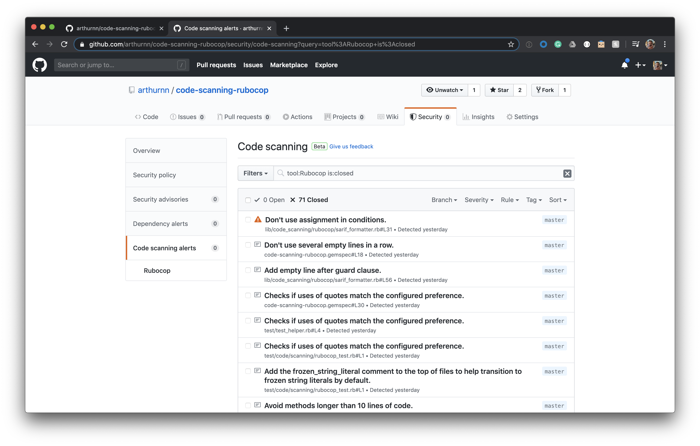

# CodeScanning::Rubocop

'code-scanning-rubocop' is a gem to integrate Rubocop and the GitHub's code scanning feature.
The repository is composed by two components. The gem which can be installed in any ruby application and a default GitHub action to ease the usage of it. 

The rubygem adds a SARIF exporter to the rubocop runner. GitHub's code scanning feature accepts a SARIF file with the 'results' (alerts) generated by the tool.
The action, is what will run rubocop with the exporter. Note: you can only run the gem within your application, and have our own action that calls rubocop. See more in the Installation and Usage sections.

This is how it would look in your Security tab:


## Action Installation 

The easiest way to install the integration, is this action template bellow. It will install the gem in your app and run it for you within the GitHub's action enviroment. To install the action create a file `.github/workflows/rubocop-analysis.yml` like the following:

```yaml
# .github/workflows/rubocop-analysis.yml
name: "Rubocop"

on: [push]

jobs:
  rubocop:
    runs-on: ubuntu-latest
    strategy:
      fail-fast: false

    steps:
    - name: Checkout repository
      uses: actions/checkout@v2

    - name: Set up Ruby
      uses: ruby/setup-ruby@v1
      with:
        ruby-version: 2.6

    # This step is not necessary if you add the gem to your Gemfile
    - name: Install Code Scanning integration
      run: bundle add code-scanning-rubocop --skip-install

    - name: Install dependencies
      run: bundle install

    - name: Rubocop run
      run: |
        bash -c "
          bundle exec rubocop --require code_scanning --format CodeScanning::SarifFormatter -o rubocop.sarif
          [[ $? -ne 2 ]]
        "

    - name: Upload Sarif output
      uses: github/codeql-action/upload-sarif@v1
      with:
        sarif_file: rubocop.sarif
```

## Gem installation & usage in a custom action
Note: this is not necessary if you use the action above.

To install the gem add this line to your application's Gemfile:

```ruby
gem 'code-scanning-rubocop'
```

Then, in your custom GitHub's action, you need to run rubocop and make sure you give it the SarifFormatter:
```bash
bundle exec rubocop --require code_scanning --format CodeScanning::SarifFormatter -o rubocop.sarif
```

As a last step, make sure you upload the `rubocop.sarif` file to the code-scan integration. That will create the Code Scanning alerts.
Thus, add this step to your custom rubocop workflow:
```yaml
    - name: Upload Sarif output
      uses: github/codeql-action/upload-sarif@v1
      with:
        sarif_file: rubocop.sarif
```


## Contributing

Bug reports and pull requests are welcome on GitHub at https://github.com/arthurnn/code-scanning-rubocop. This project is intended to be a safe, welcoming space for collaboration, and contributors are expected to adhere to the [code of conduct](https://github.com/arthurnn/code-scanning-rubocop/blob/master/CODE_OF_CONDUCT.md).


## License

The gem is available as open source under the terms of the [MIT License](https://opensource.org/licenses/MIT).

## Code of Conduct

Everyone interacting in the Code::Scanning::Rubocop project's codebases, issue trackers, chat rooms and mailing lists is expected to follow the [code of conduct](https://github.com/arthurnn/code-scanning-rubocop/blob/master/CODE_OF_CONDUCT.md).
